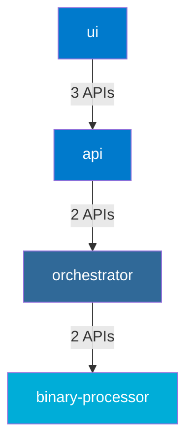

# Architecture Validation in Skidbladnir

This document outlines the architecture validation tools and processes used in the Skidbladnir project to ensure adherence to Clean Architecture principles and maintain architectural integrity in our polyglot environment.

## Overview

Skidbladnir follows Clean Architecture principles to create a maintainable, testable, and flexible system. The architecture is divided into concentric layers:

1. **Domain Layer** (innermost) - Contains business entities, value objects, and domain logic
2. **Use Case Layer** - Contains application-specific business rules and use cases
3. **Interface Adapters Layer** - Contains adapters that convert between formats suitable for external systems and the inner layers
4. **Frameworks & Drivers Layer** (outermost) - Contains frameworks, tools, and external systems

The key rule of Clean Architecture is that dependencies may only point inward. Outer layers may depend on inner layers, but inner layers must never depend on outer layers.

## Architecture Validation Tools

Skidbladnir provides several tools to validate architectural boundaries and detect violations:

### 1. Architecture Validator

The `ArchitectureValidator` analyzes TypeScript code to ensure it adheres to Clean Architecture principles:

- Identifies which architectural layer each file belongs to
- Verifies that dependencies only point inward
- Reports violations of architectural boundaries

```typescript
import { ArchitectureValidator } from './tests/unit/architecture/ArchitectureValidator';

// Validate the entire codebase
const result = ArchitectureValidator.validateArchitecture('/path/to/project');

if (result.valid) {
  console.log('Architecture is valid!');
} else {
  console.log('Architecture violations found:', result.errors);
}
```

### 2. Circular Dependency Validator

The `CircularDependencyValidator` detects circular dependencies in the codebase:

- Builds a dependency graph of the codebase
- Uses depth-first search to detect cycles
- Reports all circular dependency chains found

```typescript
import { CircularDependencyValidator } from './tests/unit/architecture/CircularDependencyValidator';

// Check for circular dependencies in a specific directory
const validator = CircularDependencyValidator.forDirectory('/path/to/directory', '/path/to/project');
const cycles = validator.detectCircularDependencies();

if (cycles.length === 0) {
  console.log('No circular dependencies found!');
} else {
  console.log('Circular dependencies detected:');
  console.log(CircularDependencyValidator.formatCircularDependencies(cycles, '/path/to/project'));
}
```

### 3. Polyglot Architecture Validator

The `PolyglotArchitectureValidator` extends architecture validation to all languages used in the project:

- Validates TypeScript, Python, and Go code
- Ensures architectural boundaries are respected across all languages
- Reports violations in a language-specific manner

```typescript
import { PolyglotArchitectureValidator } from './tests/unit/architecture/PolyglotArchitectureValidator';

// Validate architecture across all languages
const result = PolyglotArchitectureValidator.validatePolyglotArchitecture('/path/to/project');

// Check TypeScript results
if (result.typescript.valid) {
  console.log('TypeScript architecture is valid!');
} else {
  console.log('TypeScript architecture violations:', result.typescript.errors);
}

// Check Python results
if (result.python.valid) {
  console.log('Python architecture is valid!');
} else {
  console.log('Python architecture violations:', result.python.errors);
}

// Check Go results
if (result.go.valid) {
  console.log('Go architecture is valid!');
} else {
  console.log('Go architecture violations:', result.go.errors);
}
```

### 4. Cross-Language Dependency Analyzer

The `CrossLanguageDependencyAnalyzer` analyzes dependencies between services implemented in different languages:

- Identifies API calls and service dependencies across languages
- Validates that service dependencies are explicitly declared
- Detects circular dependencies between services
- Generates visualizations of service dependencies as Mermaid diagrams

```typescript
import { CrossLanguageDependencyAnalyzer } from './tests/unit/architecture/CrossLanguageDependencyAnalyzer';

// Analyze cross-language dependencies
const results = CrossLanguageDependencyAnalyzer.analyzeCrossLanguageDependencies('/path/to/project');

// Check if dependencies are valid
if (results.valid) {
  console.log('Cross-language dependencies are valid!');
} else {
  console.log('Cross-language dependency issues found:');
  console.log(CrossLanguageDependencyAnalyzer.formatAnalysisResults(results));
}

// Generate a dependency diagram
const diagram = CrossLanguageDependencyAnalyzer.generateDependencyDiagram(results);
console.log(diagram);
```

## Command-Line Tool

Skidbladnir includes a command-line tool for architecture validation, which can be used in development or CI/CD pipelines:

```bash
# Check clean architecture boundaries
npm run check:architecture -- --architecture

# Check for circular dependencies
npm run check:architecture -- --circular

# Check architecture across all languages
npm run check:architecture -- --polyglot

# Check cross-language service dependencies
npm run check:architecture -- --cross-language

# Generate dependency diagram
npm run check:architecture -- --cross-language --diagram

# Save dependency diagram to a file
npm run check:architecture -- --cross-language --diagram --diagram-output diagram.md

# Check a specific directory
npm run check:architecture -- --architecture --path pkg/domain

# Output results to a file
npm run check:architecture -- --architecture --circular --output report.txt

# Show all options
npm run check:architecture -- --help
```

## Test Suites

Skidbladnir also includes several test suites that validate architecture as part of the regular test suite:

### 1. Architecture Boundaries Tests

```bash
# Run tests to ensure architectural boundaries are respected
npm test -- --testPathPattern='ArchitectureBoundaries'
```

### 2. Circular Dependency Tests

```bash
# Run tests to ensure no circular dependencies exist
npm test -- --testPathPattern='CircularDependencyCheck'
```

### 3. Polyglot Architecture Tests

```bash
# Run tests to ensure architectural boundaries are respected across languages
npm test -- --testPathPattern='PolyglotArchitectureBoundaries'
```

### 4. Cross-Language Dependency Tests

```bash
# Run tests to ensure cross-language dependencies are valid
npm test -- --testPathPattern='CrossLanguageDependencyAnalyzer'
```

## Best Practices

1. **Run Architecture Validation Locally**: Before committing code, run architecture validation to catch violations early
2. **Include in CI/CD Pipeline**: Ensure architecture validation is part of your continuous integration process
3. **Fix Violations Promptly**: Architectural violations tend to multiply if not addressed quickly
4. **Review Test Results**: Review architecture validation test results regularly as part of code review
5. **Visualize Dependencies**: Use generated diagrams to understand service dependencies
6. **Explicitly Declare Dependencies**: Make sure all service dependencies are explicitly declared

## Common Architectural Violations

1. **Domain Depending on Use Cases**: Domain entities should never import from use cases
2. **Use Cases Depending on Interface Adapters**: Use cases should never import from controllers, presenters, or gateways
3. **Circular Dependencies**: Files or services that depend on each other directly or indirectly
4. **Leaky Abstractions**: Domain entities with infrastructure concerns
5. **Direct Framework Access**: Inner layers accessing outer layer frameworks directly
6. **Undeclared Service Dependencies**: Services using APIs from other services without declaring the dependency
7. **Using Unprovided APIs**: Services using APIs that are not explicitly provided by a service

## Fixing Architectural Violations

When architectural violations are detected, consider these approaches to fix them:

1. **Dependency Inversion**: Use interfaces to invert dependencies
2. **Move Code**: Relocate code to the appropriate layer
3. **Split Responsibilities**: Break large components into smaller, focused ones
4. **Use Events**: Use event-based communication to decouple components
5. **Apply Design Patterns**: Use design patterns like Strategy, Factory, or Observer to maintain proper dependencies
6. **Declare Dependencies**: Update service configurations to declare all dependencies
7. **Implement API Contracts**: Ensure that services only use APIs that are explicitly provided

## Configuration

The architecture validators can be configured through NPM scripts in `package.json`:

```json
{
  "scripts": {
    "check:architecture": "ts-node tests/unit/architecture/cli/check-architecture.ts",
    "lint": "npm run lint:ts && npm run lint:arch",
    "lint:arch": "npm run check:architecture -- --architecture --circular --cross-language",
    "test:arch": "jest --config=config/jest.config.js --testPathPattern='tests/unit/architecture'"
  }
}
```

## Cross-Language Dependency Analysis

The cross-language dependency analyzer is particularly useful for ensuring that our polyglot services interact correctly. It:

1. **Identifies Service Boundaries**: Maps services to their respective directories and languages
2. **Detects API Usage**: Identifies HTTP client calls and API endpoint usage
3. **Validates Dependencies**: Ensures that services only depend on APIs that are provided
4. **Detects Circular Dependencies**: Identifies circular dependencies between services
5. **Generates Visualizations**: Creates Mermaid diagrams showing service dependencies

Example Mermaid diagram output:



This visualization makes it easy to see how services are connected and identify potential issues like circular dependencies or unauthorized API usage.