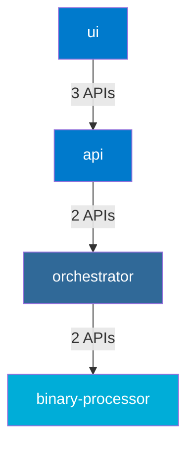

# Cross-Language Dependency Analyzer User Guide

## Overview

The Cross-Language Dependency Analyzer is a powerful tool for understanding, validating, and visualizing dependencies between services implemented in different programming languages. It ensures architectural integrity across language boundaries in our polyglot application.

## Key Features

- **Service Dependency Analysis**: Identifies which services depend on other services
- **API Usage Detection**: Discovers which APIs are being used by each service
- **Dependency Validation**: Verifies that dependencies are explicitly declared
- **Circular Dependency Detection**: Identifies circular dependencies between services
- **Visualization Generation**: Creates Mermaid diagrams showing service dependencies

## Quick Start

### Running the analyzer from the command line:

```bash
# Basic analysis
npm run check:architecture -- --cross-language

# Include visualization
npm run check:architecture -- --cross-language --diagram

# Save visualization to file
npm run check:architecture -- --cross-language --diagram --diagram-output service-diagram.md

# Output results to a file
npm run check:architecture -- --cross-language --output dependency-report.txt
```

### Example Analysis Output:

```
Cross-Language Dependency Analysis Report
===========================================

Overall Status: ✅ PASSED

Service Dependencies
-------------------
* api (typescript):
  - ✅ Depends on orchestrator (python):
      - workflows
      - test-cases

* orchestrator (python):
  - ✅ Depends on binary-processor (go):
      - attachments
      - binary-processing/jobs

* binary-processor (go):
  - No dependencies

* ui (typescript):
  - ✅ Depends on api (typescript):
      - test-cases
      - workflows
      - providers
```

### Example Mermaid Diagram:



## Service Configuration

The analyzer relies on service definitions that specify service boundaries, provided APIs, and expected dependencies. These configurations are maintained in the `CrossLanguageDependencyAnalyzer` class.

```typescript
// Example service definition
{
  name: 'api',
  port: 8080,
  language: 'typescript',
  dependencies: [
    { service: 'orchestrator', type: 'required' }
  ],
  providedApis: [
    'test-cases', 
    'workflows', 
    'providers', 
    'health'
  ],
  consumedApis: [
    'workflows',
    'test-cases'
  ],
  sourcePattern: /\/internal\/typescript\/api\/|\/cmd\/api\//
}
```

### Service Definition Fields:

- **name**: Unique service identifier
- **port**: Default port the service runs on
- **language**: Programming language used (typescript, python, go)
- **dependencies**: Expected dependencies on other services
- **providedApis**: APIs exposed by this service
- **consumedApis**: APIs this service is expected to consume
- **sourcePattern**: RegExp to identify source files for this service

## Understanding the Analysis Results

The analysis results include:

1. **Service Dependencies**: Lists each service and the other services it depends on
2. **Missing Dependencies**: Identifies dependencies that are not explicitly declared
3. **Circular Dependencies**: Highlights circular dependency chains
4. **Overall Status**: Indicates whether all service dependencies are valid

### Example of a Failed Analysis:

```
Cross-Language Dependency Analysis Report
===========================================

Overall Status: ❌ FAILED

Service Dependencies
-------------------
* api (typescript):
  - ✅ Depends on orchestrator (python):
      - workflows
      - test-cases
  - ❌ Depends on binary-processor (go):
      - attachments

* orchestrator (python):
  - ✅ Depends on binary-processor (go):
      - attachments
      - binary-processing/jobs

* binary-processor (go):
  - No dependencies

Missing Dependencies
-------------------
* api cannot use binary-processor without a proper dependency declaration:
  - attachments

```

## Best Practices

1. **Explicitly Declare Dependencies**: Always update service configurations when adding new dependencies
2. **Use Service Diagrams**: Include the generated diagrams in architecture documentation
3. **Run Before API Changes**: Check dependency analysis before making changes to service APIs
4. **CI Integration**: Include dependency validation in continuous integration pipelines
5. **Review Violations**: Address any issues identified by the analyzer promptly

## Advanced Usage

### Programmatic API

You can use the analyzer programmatically in your own scripts:

```typescript
import { CrossLanguageDependencyAnalyzer } from './tests/unit/architecture/CrossLanguageDependencyAnalyzer';

// Analyze dependencies
const results = CrossLanguageDependencyAnalyzer.analyzeCrossLanguageDependencies('/path/to/project');

// Check if valid
if (results.valid) {
  console.log('All dependencies are valid');
} else {
  console.log('Found dependency issues:');
  console.log(CrossLanguageDependencyAnalyzer.formatAnalysisResults(results));
}

// Generate a diagram
const diagram = CrossLanguageDependencyAnalyzer.generateDependencyDiagram(results);
```

### Individual Service Analysis

You can analyze a specific service's dependencies:

```typescript
// Analyze just the API service dependencies
const dependencies = CrossLanguageDependencyAnalyzer.analyzeServiceDependencies('api', '/path/to/project');
console.log(dependencies);
```

### Validation Only

You can validate dependencies without generating reports:

```typescript
// Get dependencies for a service
const dependencies = CrossLanguageDependencyAnalyzer.analyzeServiceDependencies('api', '/path/to/project');

// Validate dependencies
const validation = CrossLanguageDependencyAnalyzer.validateServiceApiUsage('api', dependencies);
console.log(validation);
```

## Troubleshooting

### Common Issues

1. **False Positives**: The analyzer may detect API calls that use similar patterns but are not actual service dependencies. Review the reported dependencies carefully.

2. **Missing Dependencies**: If the analyzer reports missing dependencies, check:
   - Whether the dependency is actually used
   - Whether it should be explicitly declared in the service configuration

3. **Circular Dependencies**: If circular dependencies are detected:
   - Consider introducing an intermediary service
   - Use event-based communication instead of direct API calls
   - Refactor to separate responsibilities

### FAQ

**Q: How does the analyzer detect API calls?**

A: It uses regex pattern matching to find HTTP client calls and URL patterns in the code. It handles different patterns for TypeScript, Python, and Go.

**Q: Do I need to update service definitions when I add new APIs?**

A: Yes, the service definitions should be updated to include new provided or consumed APIs to ensure accurate validation.

**Q: Can I visualize subset of services?**

A: Currently, the visualizer shows all services. For a more focused view, you can filter the results programmatically before generating the diagram.

**Q: How can I fix a circular dependency?**

A: Consider introducing an intermediary service, using event-based communication, or refactoring responsibilities to eliminate bidirectional dependencies.